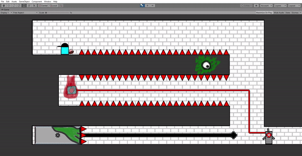

# Games Portfolio

 
<h1>ResuMaybe</h1>

<h3> </h3>

<h3> Description : </h3>

ResuMaybe is a resume-building tabletop roleplaying game, where you play as either an Interviewer looking to fill a newly opened position, or an Applicant with a randomly filled resume and no knowledge of what the job might be. With only one position up for grabs, it's up to the Interviewer to ask questions that will help them find the right candidate for them, while the Applicants fight to figure out the job and tailor their answers to be awarded with a shiny new job for their resume. 

<h3>  </h3> 

<h3> The Team : </h3> Edikan Abia, James Martini, Raymond Lothian, Kimari Rennis

<h3>  </h3> 

<h3> My Role : </h3> Game Design, Narrative Design, Writing  

<h3>  </h3> 

<h3> Status : </h3> Student Project for NYU, In Development 

<h3>  </h3> 

<h3> Find More : </h3> 

ResuMaybe is free to play [here](https://heliosraapollo.itch.io/resumaybe), and is currently undergoing further development. 

 ---
 
<h1>Bastion Manor</h1>

<h3> </h3>

<h3> Description : </h3>

Bastion Manor is a combination puzzle game and podcast series about a haunted house and the people trapped inside it. The player wanders through wreckage brought on by the unfortunate souls who perished to the Manor’s traps, using a podcast recorded by the house and its victims in order to piece together just what happened here and how they might escape. 
<h3>  </h3> 

<h3> The Team : </h3> Joon Lee, James Martini, Raymond Lothian, Kimari Rennis

<h3>  </h3> 

<h3> My Role : </h3> Game Design, Narrative Design, Writing, Voice Acting (Voice of Bastion Manor), Audio Production, Quality Assurance  

<h3>  </h3> 

<h3> Status : </h3> Student Project for NYU, In Development 

<h3>  </h3> 

<h3> Find More : </h3> 

Bastion Manor is free to play and listen to [here](https://jamesmartini.itch.io/bastion-manor) with the password "bastion". 

The scripts I wrote are available [here](https://drive.google.com/drive/folders/1JLT-702vZ0E-lhqnwVHlqW2OcNgdbOwZ?usp=sharing). 

 ---
 
 <h1>Flocking Hell</h1>

<h3> Description : </h3>

Flocking Hell, awarded **Best Non-Digital Game** at the NYU Global Game Jam 2022, is a dueling board game in which you and a rival build up  flocks of bird spread over two boards, moving them through Hell to send them boons and ailments.  

<h3>  </h3> 

<h3> The Team : </h3> Titus Pahn, KFPlumePal  

<h3>  </h3> 

<h3> My Role : </h3> Game Design, Narrative Design, Writing  

<h3>  </h3> 

<h3> Status : </h3> In Development  

<h3>  </h3> 

<h3> Find More : </h3> 

You can find out more information as we continue the game's development on the game's itch.io page [here](https://heliosraapollo.itch.io/flocking-hell?secret=Fl0fKisAXHtmMLYlcXu6GBHopY). 

 ---

<h1>.500</h1>

<h3> Description :</h3> .500 is a 2D platformer built in Unity, and was heavily inspired by the New York City subway system, Lethal League, and Earthbound.  You're late to Interdimensional Baseball practice, and to make matters worse you lost all your gear! Make your way from station to station as you reclaim your equipment, and if you're lucky you might even make it to practice on time.

<h3>  </h3>  

<h3> The Team : </h3> Emmet Hilly, John Murawski  

<h3>  </h3>  

<h3> My Role : </h3>  Level Design, Mechanics Design, Narrative Design  

<h3>  </h3> 

<h3> Status : </h3> Student Project for Northwestern University, Not Publicly Available  

<h3>  </h3> 

<h3> Find More : </h3> 

Video and image samples of the game can be found [here](https://github.com/JackWarshaw/Jacks-Personal-Work/tree/main/500-samples).

---

<h1>Cosmic Scale</h1>

<h3> Description : </h3> Cosmic Scale is a 2D infinite runner developed in PyGame, primarily for individuals who have issus with motor control. Rather than using a standard controller, players of Cosmic Scale will use the pitch of their voice to move their character, making a normally reflex centered genre accessible to whole new players.  

<h3>  </h3> 

<h3> The Team : </h3> Chloe Brown, Katrina Parekh  

<h3>  </h3> 

<h3> My Role : </h3> Game Design, Audio Engineering, Programming  

<h3>  </h3> 

<h3> Status : </h3> Student Project for Northwestern University, Released  

<h3>  </h3> 

<h3> Find More : </h3> 

More information can be found [here](https://chloemb.github.io/352project/).

