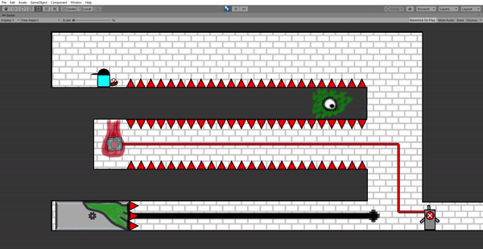
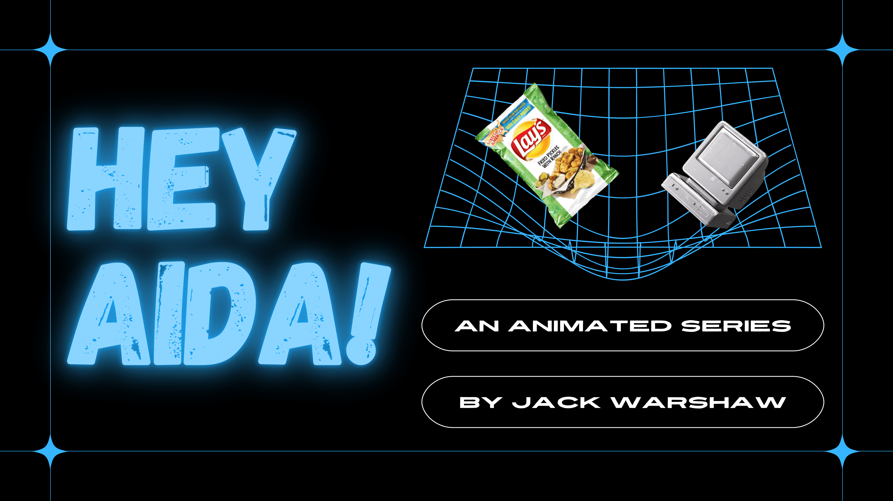

# Personal Portfolio
Here is a selection of the games, tools, and projects that I have had the pleasure of working on, both technical and creative. I hope you enjoy!
 

<h1>.500</h1>

<h3> Description :</h3> .500 is a 2D platformer built in Unity, and was heavily inspired by the New York City subway system, Lethal League, and Earthbound.  

<h3>  </h3>  

<h3> The Team : </h3> Emmet Hilly, John Murawski  

<h3>  </h3>  

<h3> My Role : </h3>  Level Designer, Mechanics Designer, Narrative Designer  

<h3>  </h3> 

<h3> Status : </h3> Student Project for Northwestern University, Not Publicly Available  

<h3>  </h3> 

<h3> Find More : </h3> 

Video and image samples of the game can be found [here](https://github.com/JackWarshaw/Jacks-Personal-Work/tree/main/500-samples).

---

<h1>Flocking Hell</h1>

<h3> Description : </h3>

Flocking Hell, awarded **Best Non-Digital Game** at the NYU Global Game Jam 2022, is a dueling board game in which you and a rival build up  flocks of bird spread over two boards, moving them through Hell to send them boons and ailments.  

<h3>  </h3> 

<h3> The Team : </h3> Titus Pahn, KFPlumePal  

<h3>  </h3> 

<h3> My Role : </h3> Game Design, Narrative Design, Writing  

<h3>  </h3> 

<h3> Status : </h3> In Development  

<h3>  </h3> 

<h3> Find More : </h3> 

You can find out more information as we continue the game's development on the game's itch.io page [here](https://heliosraapollo.itch.io/flocking-hell?secret=Fl0fKisAXHtmMLYlcXu6GBHopY). 

 ---
 
 

<h3>Hey Aida!</h3>

<h3> Description : </h3> Created during my time with The Gotham Film and Media Institue, "Hey Aida!" is an animated series about a dysfunctional virtual assistant. Currently there is a full length presentation and pitch deck for the series, and the pilot is in development.  

<h3>  </h3> 

<h3> My Role : </h3> Writer, Creator  

<h3>  </h3> 

<h3> Status : </h3> In Development  

<h3>  </h3> 

<h3> Find More : </h3> 

The pitch deck for "Hey Aida!" can be found in [here]( https://www.canva.com/design/DAElXVUasew/i11icLHf3PQJlpQBXQd-3Q/view?utm_content=DAElXVUasew&utm_campaign=designshare&utm_medium=link&utm_source=publishsharelink).

---

<h3>Cosmic Scale</h3>

<h3> Description : </h3> Cosmic Scale is a 2D infinite runner developed in PyGame, primarily for individuals who have issus with motor control. Rather than using a standard controller, players of Cosmic Scale will use the pitch of their voice to move their character, making a normally reflex centered genre accessible to whole new players.  

<h3>  </h3> 

<h3> The Team : </h3> Chloe Brown, Katrina Parekh  

<h3>  </h3> 

<h3> My Role : </h3> Game Designer, Audio Engineer, Programmer  

<h3>  </h3> 

<h3> Status : </h3> Student Project for Northwestern University, Released  

<h3>  </h3> 

<h3> Find More : </h3> 

More information can be found [here](https://chloemb.github.io/352project/).

---

<h3>KRR Character Creator</h3>

<h3> Description : </h3> 
A character generator for the tabletop roleplaying game Dungeons & Dragons (5th edition) developed by myself and my fellow students. It runs off a series of of queries made on a custom language centered knowledge base.  

<h3>  </h3> 

<h3> The Team : </h3> Irinel Bandas, Chloe Brown, Kartik Kesavabhotla  

<h3>  </h3> 

<h3> My Role : </h3> Logic Designer, Software Devloper  

<h3>  </h3> 

<h3> Status : </h3> Student Project for Northwestern University, Released  

<h3>  </h3> 

<h3> Find More : </h3> 

More information can be found [here](https://github.com/chloemb/krr_final_project).

---

<h3>Udacity Classwork</h3>

<h3> Description : </h3> 
This is the work I compiled for my Udacity nanodegree, AI for Healthcare. This includes a Tensorflow based selection system to find the ideal candidates for testing a diabetes drug based on medical files, a segmentation algorithm to ease doctors finding the location and volume of the hippocampus in 3d medical images, and a predictive model for the presence of Pneumonia in x-rays to give greater clinician priority to higher risk patients.  

<h3>  </h3> 

<h3> My Role : </h3> Software Developer  

<h3>  </h3> 

<h3> Find More : </h3> 

I have included several of the projects [here](https://github.com/JackWarshaw/Jacks-Personal-Work/tree/main/Udacity%20Work), though I only wrote portions of code and several reports on the subject, not all of the included code base.

