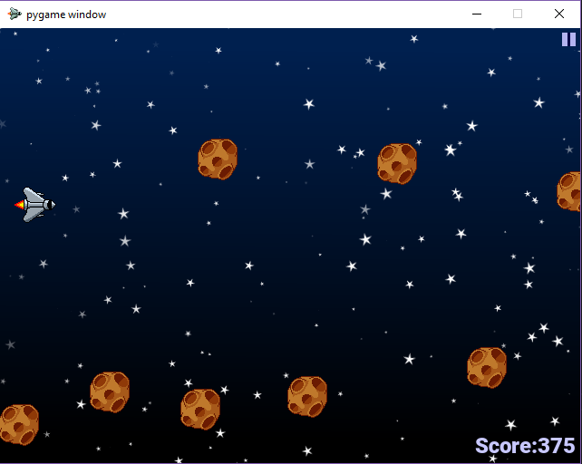

# Personal Portfolio
The work below includes technical and design work in games and technology, along side my creative work in entertainment. I hope you enjoy!
 

<h3>.500</h3>

This game was created by myself and my fellow students for a game showcase, for CS 377 at Northwestern University. This game is a 2D platformer built in the Unity engine, heavily inspired by the New York City subway system, Lethal League, and Earthbound. Video and image samples of the game are present in the 500-samples folder for this project on GitHub.

 

<h3>Cosmic Scale</h3>

This game was created by myself and my fellow students, primarily for those who have motor disadvantages that dont allow them to easily use standard controllers. Instead this game is controlled using a player's vocal pitch in real time, which lets a user play the game regardless of any motor disadvantages. It was developed for CS 352 at Northwestern University, and more information can be found at the page [here](https://chloemb.github.io/352project/).

 

<h3>KRR Character Creator</h3>

A character generator for the tabletop roleplaying game Dungeons & Dragons (5th edition) developed by myself and my fellow students. It runs off a series of of queries made on a custom language centered knowledge base (developed by a team at Northwestern University). This project was developed for CS 396 at Northwestern University, and more information can be found at the page [here](https://github.com/chloemb/krr_final_project).

 

<h3>Udacity Classwork</h3>

This is the work I compiled for my Udacity nanodegree, AI for Healthcare. This includes a Tensorflow based selection system to find the ideal candidates for testing a diabetes drug based on medical files, a segmentation algorithm to ease doctors finding the location and volume of the hippocampus in 3d medical images, and a predictive model for the presence of Pneumonia in x-rays to give greater clinician priority to higher risk patients. Samples of my work for this program can be found in the Udacity Work folder for this project on GitHub. 
