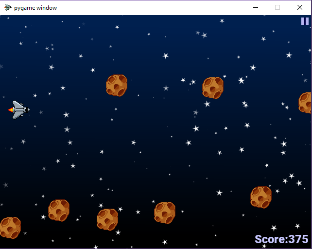

<h1>Cosmic Scale</h1>

<h3> Description : </h3> Cosmic Scale is a 2D infinite runner developed in PyGame, primarily for individuals who have issus with motor control. Rather than using a standard controller, players of Cosmic Scale will use the pitch of their voice to move their character, making a normally reflex centered genre accessible to whole new players.  

<h3>  </h3> 

<h3> The Team : </h3> Chloe Brown, Katrina Parekh  

<h3>  </h3> 

<h3> My Role : </h3> Game Design, Audio Engineering, Programming  

<h3>  </h3> 

<h3> Status : </h3> Student Project for Northwestern University, Released  

<h3>  </h3> 

<h3> Find More : </h3> 

More information can be found [here](https://chloemb.github.io/352project/), and you can see our gameplay demo [here](https://www.youtube.com/watch?v=vCUaTwgwivM&ab_channel=ChloeB).

## [<== Back](https://jackwarshaw.github.io/Jacks-Personal-Work/)
