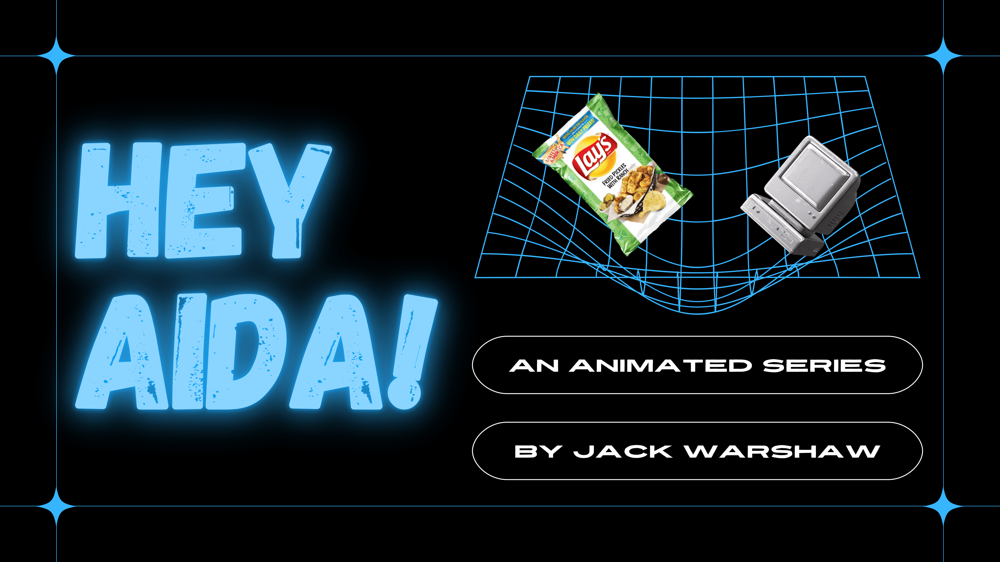

<h1>Hey Aida!</h1>

<h3> </h3>

<h3> Description : </h3> Created during my time with The Gotham Film and Media Institue, "Hey Aida!" is a potential animated series about a dysfunctional virtual assistant. Currently there is a full length presentation and pitch deck for the series, and the pilot is undergoing revisions.  

<h3>  </h3> 

<h3> Process : </h3>

I came up with the idea for "Hey Aida!" during group ideation with The Gotham EDU cohort of 2021. Originally, the premise was based around a therapist minotaur that would help monsters with their various issues, though eventually the minotaur changed to an AI and the monsters became people in a virtual world. After consulting with mentors in the program, the AI's role as a therapist was refined to that of a digital assistant, and "Hey Aida!" became what it is today. 

<h3> </h3> 

The series' pitch deck began with the premise of the show as its base. This allowed me to focus on what made the show unique and exciting (the digital environment, its diverse cast, the emergent underlying narrative), while keeping in mind the ways it could be made and how similar shows had been produced. 

<h3>  </h3> 

<h3> My Role : </h3> Writing, Show Running

<h3>  </h3> 

<h3> Status : </h3> In Development  

<h3>  </h3> 

<h3> Find More : </h3> 

The pitch deck for "Hey Aida!" can be found in [here]( https://www.canva.com/design/DAElXVUasew/i11icLHf3PQJlpQBXQd-3Q/view?utm_content=DAElXVUasew&utm_campaign=designshare&utm_medium=link&utm_source=publishsharelink).
