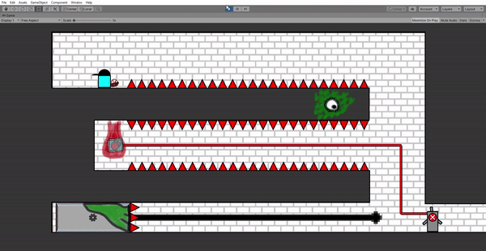

| <h3>[.500]()</h3>  | 
| ------------- |
| <h3 align="center">[ResuMaybe](https://jackwarshaw.github.io/Jacks-Personal-Work/)</h3>  |
| <h3 align="center">[ResuMaybe]()</h3>  |
|  |
.grid {
display: grid;
grid-template-columns: 100px 100px 100px;
grid-template-rows: 50px 50px 50px;
}

  
<h3>[.500]()</h3> 

  
<h3 align="center">[ResuMaybe](https://jackwarshaw.github.io/Jacks-Personal-Work/)</h3> 

  
<h3 align="center">[ResuMaybe]()</h3> 

  
<h3 align="center">[ResuMaybe](https://jackwarshaw.github.io/Jacks-Personal-Work/)</h3> 

  
5

  
6

  
7

  
8

  
9

